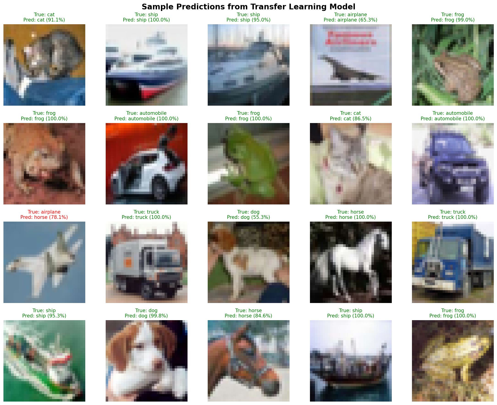
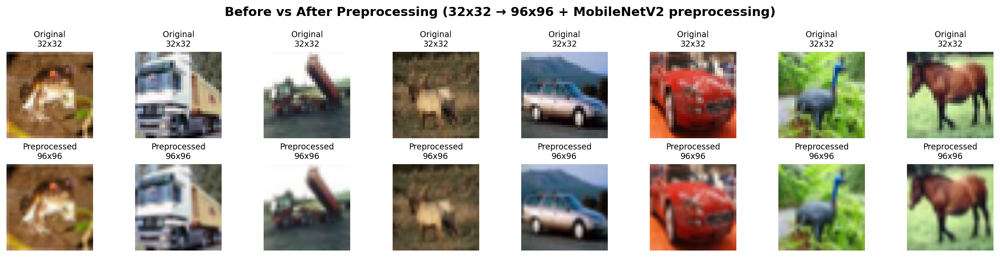
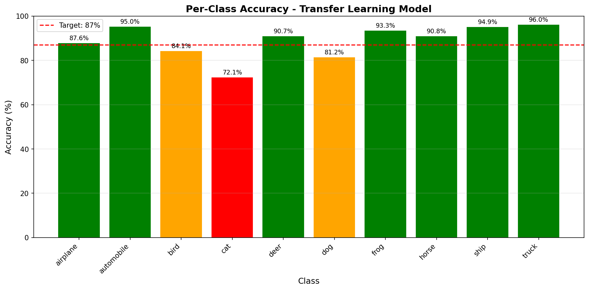
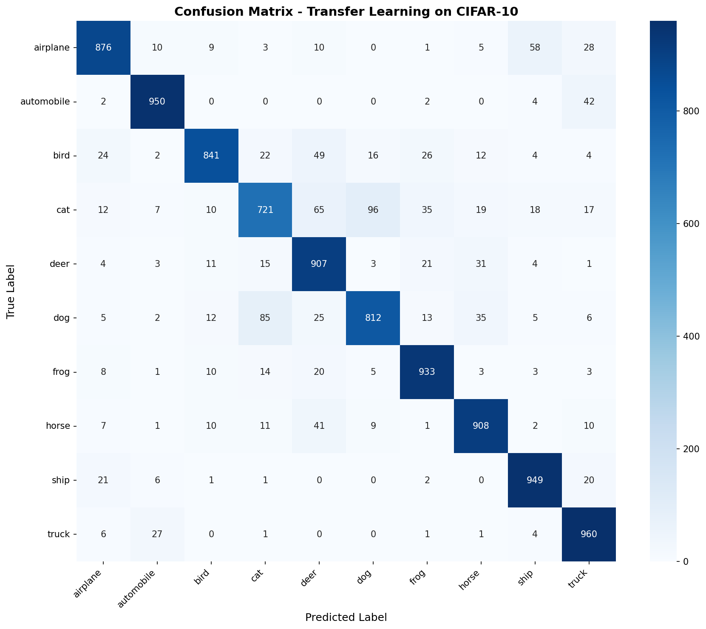

# Transfer Learning with CIFAR-10 🚀

This project demonstrates **Transfer Learning** using a pre-trained MobileNetV2 model on the CIFAR-10 dataset.

## 📋 Project Overview

- **Dataset**: CIFAR-10 (60,000 images, 10 classes)
- **Base Model**: MobileNetV2 (pre-trained on ImageNet)
- **Training Strategy**: Feature Extraction + Fine-Tuning
- **Target**: ≥87% validation accuracy
- **Result**: **88.57% test accuracy** ✅

---

## 🎯 Objectives

1. Implement a `preprocess_data(X, Y)` function
2. Use Transfer Learning with a Keras pre-trained model
3. Train on CIFAR-10 dataset
4. Achieve 87%+ validation accuracy
5. Save the trained model as `cifar10.h5`

---

## 📦 Requirements

```bash
# Create virtual environment
python3 -m venv transfer_venv
source transfer_venv/bin/activate

# Install dependencies
pip install tensorflow matplotlib seaborn scikit-learn numpy
```

**Minimum specs:**
- RAM: 8 GB (16 GB recommended)
- GPU: Optional but highly recommended (Kaggle/Colab free GPU works great)

---

## 🔧 Installation & Setup

```bash
# Clone only the transfer_learning directory (lightweight)
git clone --filter=blob:none --sparse https://github.com/Enzo949494/holbertonschool-machine_learning.git
cd holbertonschool-machine_learning
git sparse-checkout set supervised_learning/transfer_learning

# Navigate to the project directory
cd supervised_learning/transfer_learning

# Create and activate virtual environment
python3 -m venv transfer_venv
source transfer_venv/bin/activate

# Install dependencies
pip install tensorflow matplotlib seaborn scikit-learn numpy

# Verify installation
python3 -c "import tensorflow as tf; print(f'TensorFlow {tf.__version__} ready!')"
```

> **Note:** The sparse clone only downloads the `transfer_learning` folder (~50 MB) instead of the entire repository (~500+ MB).

---

## 🚀 Usage

### 1. Train the Model

**Option A: Local Training (CPU - slow, ~12h)**
```bash
./0-transfer.py
```

**Option B: Kaggle/Colab (GPU - fast, ~2-3h)** ⭐ Recommended
1. Go to [kaggle.com/code](https://www.kaggle.com/code)
2. Create new notebook
3. Settings → Accelerator → **GPU T4 x2**
4. Settings → Internet → **ON**
5. Copy the content of `0-transfer.py`
6. Run all cells
7. Download `cifar10.h5` from Output

### 2. Test the Preprocessing Function

```bash
./0-main.py
```

Expected output:
```
X shape: (10000, 96, 96, 3)
Y shape: (10000, 10)
X type: <class 'numpy.ndarray'>
Y type: <class 'numpy.ndarray'>

✓ preprocess_data() works correctly!
```

### 3. Generate Visualizations

```bash
./plot_results.py
```

This generates 5 visualization files (see below).

---

## 📊 Results

### Final Performance

```
Test Accuracy: 88.57%
Test Loss: 0.3347
Target: 87% ✅
```

### Sample Predictions



*Green = Correct prediction | Red = Incorrect prediction*

### Before/After Preprocessing



*Images are resized from 32x32 to 96x96 and preprocessed for MobileNetV2*

### Per-Class Accuracy



*Most classes achieve >85% accuracy*

### Confusion Matrix



*Common confusions: cat↔dog, automobile↔truck*

---

## 🧠 How It Works

### 1. Preprocessing (`preprocess_data`)

```python
def preprocess_data(X, Y):
    # Resize 32x32 → 96x96 (MobileNetV2 minimum)
    X_p = tf.image.resize(X, (96, 96))
    
    # Apply MobileNetV2 preprocessing
    X_p = preprocess_input(X_p)
    
    # One-hot encode labels
    Y_p = K.utils.to_categorical(Y, 10)
    
    return X_p.numpy(), Y_p
```

### 2. Two-Phase Training

#### Phase 1: Feature Extraction (Fast)
- Load MobileNetV2 with ImageNet weights
- **Freeze** all base model layers
- Extract features once
- Train a small classifier on top

#### Phase 2: Fine-Tuning (Slow but accurate)
- **Unfreeze** last 20 layers of MobileNetV2
- Use very low learning rate (1e-5)
- Apply data augmentation
- Fine-tune on CIFAR-10

### 3. Training Strategy

```
Dataset Split:
├── Training:   40,000 images (80%)
├── Validation: 10,000 images (20%)
└── Test:       10,000 images

Model Architecture:
├── MobileNetV2 (pre-trained, partially frozen)
├── Dropout(0.5)
├── Dense(128, relu)
├── Dropout(0.5)
└── Dense(10, softmax)

Callbacks:
├── EarlyStopping (patience=10)
└── ReduceLROnPlateau (patience=5)
```

---

## 📁 File Structure

```
transfer_learning/
├── 0-transfer.py           # Main training script
├── 0-main.py               # Test script
├── plot_results.py         # Visualization script
├── cifar10.h5              # Trained model (88.57% accuracy)
├── README.md               # This file
├── .gitignore              # Ignore venv and cache
│
├── sample_predictions.png          # Generated visualizations
├── before_after_preprocessing.png
├── per_class_accuracy.png
├── confusion_matrix.png
└── model_architecture.png
```

---

## 🎓 Key Concepts

### Transfer Learning
Reusing a model trained on a large dataset (ImageNet, 1M+ images) for a smaller dataset (CIFAR-10, 60K images).

### Feature Extraction
Using the pre-trained model as a fixed feature extractor (frozen weights).

### Fine-Tuning
Unfreezing some layers and retraining them with a very low learning rate to adapt to the new dataset.

### Data Augmentation
```python
rotation_range=20
width_shift_range=0.2
height_shift_range=0.2
horizontal_flip=True
zoom_range=0.2
```

---

## 🐛 Troubleshooting

### Out of Memory Error
```bash
# Reduce batch size in 0-transfer.py
batch_size=250  # Instead of 500
```

### Low Accuracy (<87%)
- Use more training data (increase from 20K to 40K samples)
- Train for more epochs
- Increase model capacity (Dense 256 instead of 128)
- Try a different base model (ResNet50, EfficientNet)

### GPU Not Detected
```bash
# Check GPU availability
python3 -c "import tensorflow as tf; print(tf.config.list_physical_devices('GPU'))"

# If empty, use Kaggle/Colab instead
```

---

## 📚 CIFAR-10 Classes

```
0: airplane    5: dog
1: automobile  6: frog
2: bird        7: horse
3: cat         8: ship
4: deer        9: truck
```

---

## 🏆 Performance Tips

1. **Use GPU** (Kaggle/Colab free tier is sufficient)
2. **More data = better accuracy** (use full 50K training set)
3. **Data augmentation** prevents overfitting
4. **Two-phase training** is faster than end-to-end fine-tuning
5. **Early stopping** prevents overfitting

---


## 👤 Author

**Your Name**
- GitHub: [@Enzo949494](https://github.com/Enzo949494)
- Project: Holberton School Machine Learning

---

## 📄 License

This project is part of the Holberton School curriculum.

---
